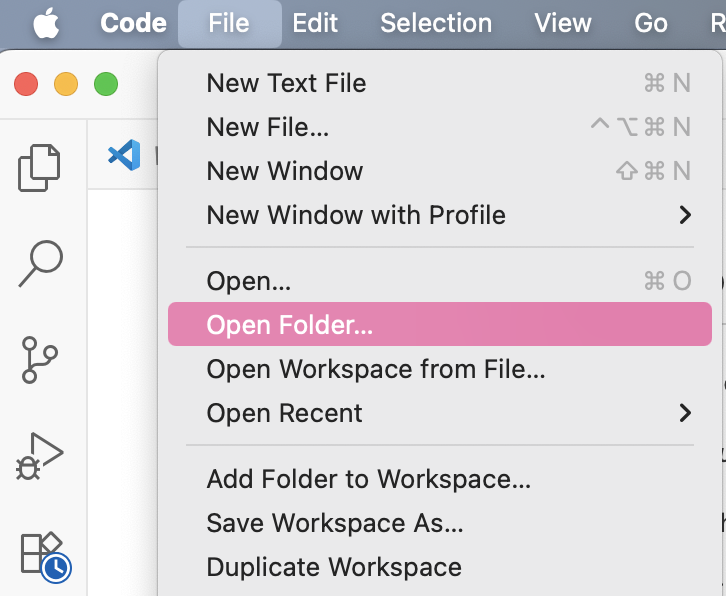
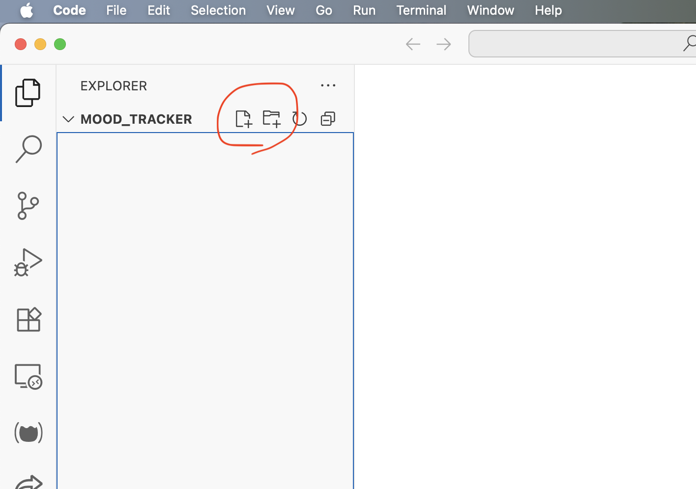

# Section 1. Leaving familiar places
## Lesson 1.6 Project Organization

**Your computer is a giant filing cabinet,** of sorts. But instead of drawers we have folders (often called *directories* in the engineering lingo).

The whole operating system looks something like this:
## Windows
```
C:\ (Your main hard drive - like the whole filing cabinet)
├── Program Files/           (Where applications live 🎮)
├── Windows/                 (Operating system files ☠️)
├── Users/                  
│   └── YourName/           (Your personal space)
│       ├── Desktop/        (What you see on the screen behind all the windows
							 and I hope NOT where you store half of your files)
│       ├── Documents/      (Your main work folder. 
							  That's where things are supposed to go technically)
│       ├── Downloads/      (The second half of all your files is likely here)
│       ├── Pictures/
│       └── Videos/
└── temp/                   (Temporary files)
```
## Mac 
```
/ (The root - like the whole filing cabinet)
├── Applications/          (Where your apps live 🎮)
├── System/                (Operating system files ☠️)
├── Users/
│   └── yourname/          (Your home folder -- place for your files. 
							It also has a few hidden configuration files)
│       ├── Desktop/       (What you see on the screen behind all the windows
							 and I hope NOT where you store half of your files)
│       ├── Documents/     (Your main work folder -- I never use it 🤷🏻‍♀️)
│       ├── Downloads/     (The second half of all your files is likely here)
│       ├── Pictures/
│       └── Movies/
└── tmp/                   (Temporary files)
```
**The tree symbols show hierarchy:**
- `├──` means "contains"
- `└──` means "last item in this folder"
- Indentation shows what's inside what - further right means deeper inside

**On the diagrams above is  your entire digital filing cabinet.** When you save a file, you're putting it in one of these *directories*. 

## How to organize your projects

A lot of us have a habit of leaving files where they first landed when we downloaded them from the internet, which is often either `Downloads` or `Desktop` folder. (My Downloads folder, for example, has almost 500 files, some of which are more than 7 years old 🫠)

So, it might feel tempting to do the same with your python projects and just keep all you files in a ways shown below. 
```
Download/
├── Untitled-0.ipynb
├── Untitled-1.ipynb
├── important_analysis.ipynb 
├── important_analysis_v2.ipynb
├── data.csv 
├── other_data.csv
├── screenshot_of_error.png 
├── random_paper.pdf 
└── ...460 more files...
```

However, it is not very a productive development environment.

**Try answering these questions with this setup:**
- Which notebook has your latest working code?
- Where's the data file that goes with `important_analysis_v2.ipynb`?
- Can you find the specific error you were debugging last week?
- If your laptop crashes, which files do you actually need to backup?


**So, as engineers we organize our coding files something like this:**
```
mood-tracker/        (meanigful name)
├── README.md        (kinda main information about our app)
├── app.py           (code of the main application)
├── src/             (the rest of the code files)
├── tests/           (tests which we can run to ensure everything still works)
├── data/            (what kind of life is it without data? 🤷🏻‍♀️)
└── docs/            (everyone likes this one 😏)
```

**With this structure:**
- **You know exactly where everything is** - well, at least until your codebase is under 20 000 lines long
- **You can share your work easily** - just zip the whole folder, or even better -- use `git` (will discuss this a bit later)
- **If you work with others, they can understand your project** - the structure tells the story
- **You can backup what matters** - the entire project is self-contained
- **When you begin working in a team and use dev tools like git** - you simply wouldn't be able to go with a bunch of scattered files

>**Note**
>These patterns emerged because enough people lost  their work and time hunting for files and searching where the heck they defined a function. When your project grows from 1 file to 100 files across months of work, the difference between organized and chaotic becomes the difference between productive development and constant frustration.
# Practice

- [ ] **Step 1. Choose Your Development Location**
	- [ ] Think in which folder you are likely to stay organized. Open that folder with your file browser (or however you wish) and create a folder `mood_tracker`. No spaces, just an underscore -- it'll be easier this way.
	- [ ] Now open VSCode, go to file menu and click `Open folder`

 

It is generally a good idea to **_always_** use `Open Folder` instead of opening an individual file.

*When you open a folder, VS Code treats it as a project workspace and gives you some nice features.
For example, it indexes (scans and catalogs) all the files in that project. This indexing is what enables:
- **Jump to definition** - Click on a function name, jump to where it's defined
- **Find all references** - See everywhere a variable or function is used
- **Smart autocomplete** - Suggests functions and variables from your other files
- **Quick file search** - `Ctrl+P` to instantly find any file in your project

You can also use `Open Recent` to open projects with which you worked recently.

- [ ] **Step 2. Create Project Structure**
	- [ ] Now we can create all the necessary project structure right inside the VS Code
	- [ ] Use left tabs' `EXPLORER` New File and an New Folder buttons to create the following folders and files

- [ ] File: `README.md` -- here we'll explain our excited users (us) what our app is all about
- [ ] Directory: `src` -- realistically speaking our app is too small to have it. But we'll use it to learn some important Python concepts
- [ ] File: `app.py` -- here all fun will happen
- [ ] Directory: `docs` -- these are very useful in bigger projects. We will keep ours empty

- [ ] **Step 3: Document Your Project**

Every project should have some kind of README file, which other people (or us 6 months later) can reference to learn what the project is about. 
- [ ] Let's add this to `README.md`:

````markdown
# MoodTracker

A command-line application for tracking daily emotions, based on the research by Pixar's "Inside Out".

## What it does
- Log emotions with intensity levels (1-3)
- Store mood data persistently
- Analyze mood patterns over time
- Professional command-line interface

## Requirements
- Python 3.12+
- Command-line terminal

## Usage
```bash
python mood_logger.py happy 2    # Log happy mood, intensity 2
python mood_logger.py stats      # Show mood statistics  
python mood_logger.py help       # Show all commands
````

>**Note**
>`.md` file extension means *markdown*. Markdown is markup language with simple formatting syntax designed to be easy to read and write as plain text. If you are unfamiliar with it follow the two links below. It's very simple.
>1. https://www.markdownguide.org/basic-syntax/#overview
>2. https://www.markdownguide.org/basic-syntax/#code

## Question 1
**You're working on a mood tracking project and need to save a CSV file with your test data. Where should it go?**

- a) `C:\Users\CoolFella\Desktop\test_data.csv` -- It's very important data, I need to see it all the time
- c) `mood-tracker\data\test_data.csv` 
- d) `mood-tracker\test_data.csv` 

## Question 2

**I mentioned VS Code "indexes" files when you open a folder. What potential problem might occur if you accidentally opened your entire `C:\` drive (or `/` on Mac) as a VS Code workspace?**
- a) VS Code would crash immediately
- b) VS Code would become extremely slow while trying to index millions of system files
- c) It would delete system files
- d) It would only index Python files

---
>**Note**
>In the end of this lesson you have 2 options you can choose from. No matter which you choose you'll find your way back to the main course

[Rest Stop -- A little bit about file extensions](1_leaving_colab/6a_file_extensions.md)
[Next Lesson](1_leaving_colab/7_basic_terminal.md)

<details>
<summary><b>Answers to this lesson Practice</b></summary>
<b>1. Correct answer:</b>
<b>c)</b> 
<p>
If you are working on a project that is going to grow, it would be really nice to have
        a separate folder for your data.
<p>
<b>2. Correct answer:</b>
<b>b)</b> 
<p>
You will see VS Code going really slow as well, if you work in a company on a "monorepo" -- a big code base that contains work of tens or even hundreds engineers. Too much to index.
</details>
<!-- end of answers section -->

